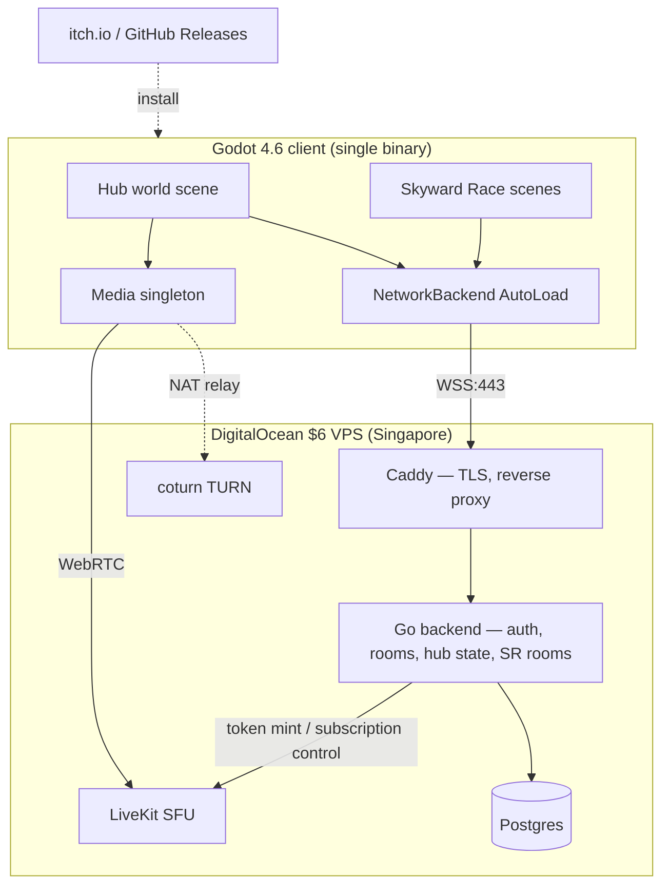
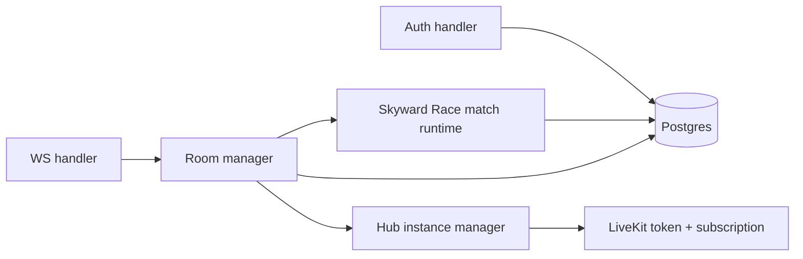

# Architecture

## Topology



Single box hosts everything. Caddy fronts all traffic for TLS + Let's Encrypt auto-renewal. No CDN, no managed services.

## Decided stack

| Layer | Choice | Reason |
| --- | --- | --- |
| Client engine | Godot 4.6.2 | Best 2D pixel pipeline, free, GDScript fast to iterate |
| Backend lang | Go (stdlib `net/http`, `coder/websocket`, `pgx/v5`, `sqlc`, `slog`) | Single static binary, low RAM, easy ops |
| Auth | Self-rolled bcrypt + JWT | No vendor dep, no monthly cost |
| Transport | WSS via `WebSocketMultiplayerPeer` | See [[Networking - Transport & Auth]] |
| DB | Postgres on same VM (`shared_buffers=128MB`) | Single source of truth |
| Media | LiveKit self-hosted SFU | Mesh rejected — too painful to migrate from |
| TURN | coturn on same VM | LiveKit needs it for symmetric NATs |
| TLS / proxy | Caddy | Auto Let's Encrypt, simple Caddyfile |
| Email | Gmail SMTP w/ app password | Free up to 500/day, fine for 50 users |
| Backups | `pg_dump \| age` → private GitHub repo nightly | Free, encrypted |
| CI | GitHub Actions | Free for this scale |
| Distribution | itch.io + GitHub Releases | No Steam Direct fee, simple |

> [!warning] Why **not** Steam right now
> Steamworks needs a $100 Steam Direct deposit per app. For a school-friend audience that's not justified. Network layer is built with a swappable `MultiplayerPeer` so a future Steam port is a peer swap, not a rewrite. See [[Open Questions]].

## Repo shape (actual as of 2026-05-23)

All in `pdc_final_project` on the `port/godot` branch:

```
/                   pygame original — pinned to main, untouched on port/godot
/godot              Godot 4.6 client — scaffolded
/server             Go backend — Phase 1.1 scaffolded; single binary serves auth + rooms + LiveKit tokens
/infra              docker-compose stack: server + postgres + caddy + livekit + coturn — not yet written
```

**Single-repo decision (2026-05-23):** kept the server in `/server` subfolder rather than splitting to a separate repo. Reasons: one clone for any contributor, Phase 1-10 scope reviewable as one PR series, coursework grade still depends on this repo so split is deferred to post-grade. Module path `github.com/CS-StudentGroup/pdc_final_project/server` — change one line + import rewrites when we eventually split.

**`server-world` + `server-api` merged into one `/server` binary** — same as the early plan ("may merge into server-world early"). Both products (Skyward Race + hub world) share auth, session, and persistence; a single Go process with package-level boundaries is simpler than two services that would always be deployed together at this scale.

**No `/shared` folder yet.** Wire protocol types live in the [[Networking - Message Contract|vault contract doc]] and are hand-mirrored Go ↔ GDScript. Promote to a real `/shared` package only if drift bites.

## Service split inside the Go backend



One process. Multiple goroutine pools. No microservices. If the box ever struggles, the first thing that gets split off is LiveKit (already its own process), not the Go server.

## Capacity sanity check

- 50 users total, ~15 hub instances peak, ~5 SR matches peak
- Per-client WS traffic: ~5 KB/s in hub (position sync), ~10 KB/s in SR match
- Aggregate: well under 1 MB/s out, ~30 GB/mo bandwidth — fits in the 1 TB plan
- LiveKit voice: ~32 kbps/track × ~14 tracks/instance = ~56 KB/s per hub client; OK
- LiveKit video: ~150 kbps × 4 tracks subscribed = ~75 KB/s per client when opted in
- 1 GB RAM is tight with LiveKit + Postgres + Go + Caddy + coturn — see [[Infra & Hosting]] for budget

## Related

- [[Infra & Hosting]]
- [[Networking - Overview]]
- [[Roadmap]]
