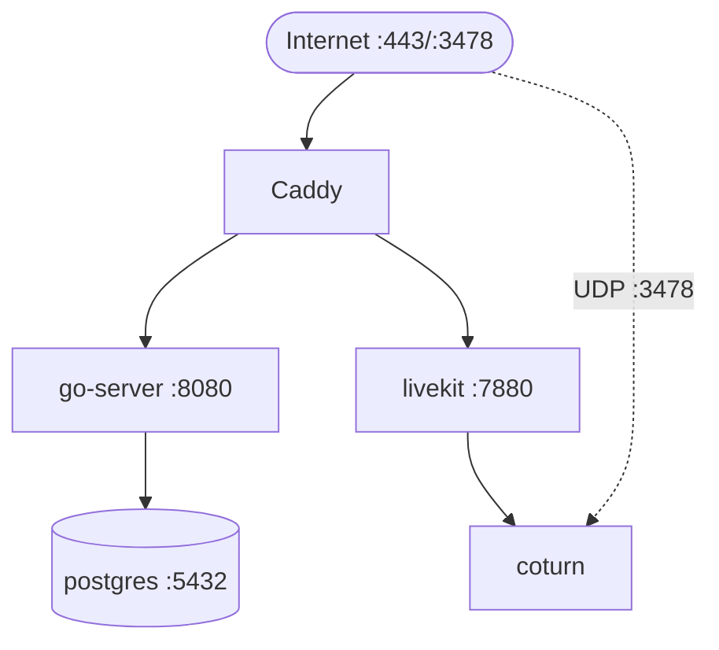

# Infra & Hosting

## The box

| Spec | Value |
| --- | --- |
| Provider | DigitalOcean Basic Droplet |
| Region | Singapore (SGP1) |
| Plan | $6/mo |
| RAM | 1 GB |
| CPU | 1 vCPU |
| Storage | 25 GB SSD |
| Bandwidth | 1 TB/mo |
| OS | Ubuntu 24.04 LTS |

Singapore chosen because the user is in PH; Hetzner ruled out (no Asia DC, ~300 ms RTT to PH). Cloudflare deferred — not needed at this scale, and signup may reject the user's card.

## Services on the box



All services run via `docker-compose` in `/opt/cssocialgame/`.

| Service | Image | Port | Notes |
| --- | --- | --- | --- |
| caddy | `caddy:2-alpine` | 80, 443 | TLS via Let's Encrypt; reverse proxy to go-server + livekit |
| go-server | self-built | 8080 (internal) | Single Go binary, ~30 MB image |
| livekit | `livekit/livekit-server` | 7880 (internal), 7881 TCP, 50000–50100 UDP | Self-hosted SFU |
| coturn | `coturn/coturn` | 3478 UDP (public), 5349 TLS | TURN relay for symmetric NATs |
| postgres | `postgres:16-alpine` | 5432 (internal) | `shared_buffers=128MB`, `work_mem=4MB` |

## RAM budget (target peak)

| Service | RAM | Notes |
| --- | --- | --- |
| postgres | ~180 MB | Tuned for small box |
| livekit | ~250 MB | 15 concurrent in one instance |
| coturn | ~50 MB | Mostly idle |
| go-server | ~80 MB | Goroutine-per-room model |
| caddy | ~40 MB | Static |
| OS + docker | ~200 MB | |
| **Total** | **~800 MB** | Leaves ~200 MB headroom on 1 GB box |

> [!warning] Headroom is thin
> If we add features (e.g., recordings, transcripts) we will OOM. The first lever is bumping to the $12 Droplet (2 GB / 1 vCPU), not architecting differently.

## CPU budget

- Idle baseline: ~5%
- One full hub instance with voice on: ~30%
- One full hub instance + one SR match: ~50%
- Two full hub instances + two SR matches: estimated ~85% — close to red

Audience size ensures we rarely hit the two-instance case. Monitor with `htop`/`docker stats` initially; add Prometheus if it becomes a real question.

## Bandwidth budget

| Component | Per-client | × clients | Aggregate |
| --- | --- | --- | --- |
| Hub position sync | 5 KB/s | 15 | 75 KB/s |
| Voice (all subscribed) | 56 KB/s in | 15 | 840 KB/s in, 840 KB/s out |
| Video (4 subs, 200 kbps each) | 100 KB/s | half publish | ~750 KB/s out |
| SR match sync | 10 KB/s | 8 | 80 KB/s |
| **Peak total out** | | | ~1.7 MB/s |

At 1.7 MB/s sustained, 1 TB/mo = ~163 hours of full activity. Far more than 50 school users will generate.

## DNS & TLS

- Domain: TBD — either `~$10/yr` for `.com`, or free `is-a.dev` / `duckdns.org` initially.
- A record points at the Droplet IP.
- Caddy auto-provisions Let's Encrypt cert on first request.
- LiveKit needs its own subdomain (`livekit.example.com`) for separate cert.

## Caddyfile sketch

```caddyfile
hub.example.com {
    handle /ws* {
        reverse_proxy go-server:8080
    }
    handle /auth/* {
        reverse_proxy go-server:8080
    }
    handle /api/* {
        reverse_proxy go-server:8080
    }
    handle {
        respond "CSSocialGame" 200
    }
}

livekit.example.com {
    reverse_proxy livekit:7880
}
```

## Backups

- Nightly `pg_dump | age -r <pubkey>` → committed to a **private** GitHub repo via deploy key
- Restore tested quarterly
- No off-site beyond GitHub (acceptable — GitHub has its own DR)

## Deploy

- GitHub Actions builds Go binary + Docker images on push to `main` of the server repo
- Builds pushed to GHCR
- Manual `ssh + docker-compose pull && docker-compose up -d` on the box (no CD pipeline initially — small audience, drift risk is low)
- Eventually add a `deploy.sh` that does the same over SSH from CI

## Email (transactional)

- Gmail SMTP with app password (no card needed)
- 500 sends/day cap — fine for 50 users; verification + password reset only
- Sender: `noreply@gmail.com` (acceptable for school project)
- If we ever outgrow this, Postmark/Resend free tiers are next

## Costs (all-in)

| Item | Cost | Cadence |
| --- | --- | --- |
| Droplet | $6 | monthly |
| Domain | ~$10 | yearly (or $0 with free subdomain) |
| Email | $0 | — |
| Backups storage | $0 | — |
| CI | $0 | GitHub Actions free tier |
| **Total** | **~$6.83/mo amortized** | |

## Related

- [[Architecture]]
- [[Networking - Overview]]
- [[Networking - Proximity Media]]
