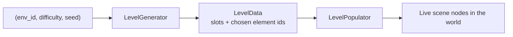

# Levels & Environments

How Skyward Race generates its tower levels and how multiple themed environments share that machinery.

## Goal

- Procedurally generated tower levels from `(env_id, difficulty, seed)` — same inputs always produce the same level on every machine
- Multiple visual environments at launch: **Sky** (neutral baseline) and **Ice** (fragile platforms, icicles)
- Each environment has its own art + music + element pool, including elements exclusive to that environment
- Host picks env + difficulty 1–10 as **two independent selectors** in the lobby
- Adding a new environment later = drop a `.tres` file, zero code changes

## Two-layer split

The single most important design decision:



- **Topology generation is environment-agnostic.** It produces a list of *slots* — "platform here", "hazard here", "pickup here" — based on difficulty + seed alone.
- **Population is environment-aware.** It walks the slots and picks concrete elements from the environment's pool.

Same skeleton, different skin. Same level 5 topology can be a Sky run or an Ice run with completely different feel.

> [!info] Why this matters
> Server only ships `(env_id, difficulty, seed)` to clients (~16 bytes per match). Every client regenerates identical geometry. No level data on the wire. Late joiners + spectators get the same level by replaying the generator.

## The three Resource types

All custom Godot `Resource` subclasses, edited as `.tres` files in the editor:

### `Element` — one gameplay piece

```gdscript
class_name Element extends Resource

enum Category { PLATFORM, HAZARD, PICKUP, MECHANISM }

@export var id: StringName                  # "fragile_ice_platform"
@export var display_name: String
@export var category: Category
@export var scene: PackedScene              # the actual node to spawn
@export var base_weight: float = 1.0        # selection weight when picking from a slot pool
@export var min_difficulty: int = 1
@export var max_difficulty: int = 10
@export var tags: Array[StringName] = []    # ["fragile", "slippery", "moving"]
@export var min_horizontal_clearance: int = 0  # for placement constraints
@export var min_vertical_clearance: int = 0
```

### `LevelEnvironment` — a theme + element bag

> [!warning] Class rename
> The original spec used `class_name Environment`, which **shadows Godot's built-in `Environment`** (3D rendering settings). At implementation time (Phase 4a.1, 2026-05-24) we renamed the class to `LevelEnvironment`. The wire-protocol field `environment_id` is unchanged — the rename is purely the Godot class symbol.


```gdscript
class_name LevelEnvironment extends Resource

@export var id: StringName                  # "ice"
@export var display_name: String            # "Frostpeak"
@export var description: String             # 1-line shown under selector
@export var preview_icon: Texture2D         # small icon for room cards + lobby picker
@export var background_scene: PackedScene   # full-screen background (parallax-ready)
@export var music: AudioStream
@export var palette: PalettePreset          # bg color, accent colors for UI tint

@export var element_set: Array[EnvElementEntry]   # see below
@export var ambient_particles: PackedScene = null  # snow flakes / lava embers / etc.

# Optional per-env modifier of the topology generator (e.g., Ice has tighter spacing)
@export var topology_modifier: TopologyModifier = null
```

```gdscript
class_name EnvElementEntry extends Resource

@export var element: Element
@export var weight_override: float = -1.0   # -1 means "use element.base_weight"
```

### `LevelData` — generator output

```gdscript
class_name LevelData extends Resource

@export var env_id: StringName
@export var difficulty: int
@export var seed: int
@export var total_height: int               # px from bottom to goal
@export var slots: Array[SlotInfo]
```

```gdscript
class_name SlotInfo extends Resource

@export var position: Vector2i              # logical 320×180 coords
@export var category: Element.Category
@export var chosen_element_id: StringName   # populator looks this up
@export var instance_seed: int              # deterministic sub-seed for the element scene
```

## The two scripts

### `LevelGenerator` — pure deterministic function

```gdscript
class_name LevelGenerator extends RefCounted

static func generate(env: Environment, difficulty: int, seed: int) -> LevelData:
    var rng := RandomNumberGenerator.new()
    rng.seed = seed

    var height := _compute_height(difficulty)
    var slots := _generate_topology_slots(rng, difficulty, height)
    var data := LevelData.new()
    data.env_id = env.id
    data.difficulty = difficulty
    data.seed = seed
    data.total_height = height
    data.slots = _populate_slots(rng, env, difficulty, slots)
    return data
```

Topology generation uses a **band-based** structure (a tower divided into horizontal bands):

```
Top    ┌───────────────────┐  goal
       ├───────────────────┤
       │  [P]    [P]   [O] │  band N (top)
       ├───────────────────┤
       │   [H]  [P]        │
       ├───────────────────┤
       │  [P]   [P]   [P]  │
       ├───────────────────┤
       │ ...               │
       │                   │
Bottom └───────────────────┘  spawn
```

Per band: 2–4 platform slots, 0–1 hazard slot, 0–1 pickup slot. Density and hazard chance scale with `difficulty`. Connectivity invariant: at least one platform per band must be reachable from a platform in the band below (jumpable distance).

### `LevelElement` — base class every element scene root extends

```gdscript
class_name LevelElement extends Node2D

## Base for every spawnable element (platform, hazard, pickup, mechanism).
##
## Override `init_with_seed` if the element needs per-spawn randomization
## (visual variant, slight position jitter, etc.). The default no-op is fine
## for elements with no per-instance variance.

func init_with_seed(_seed: int) -> void:
    pass
```

Stateful elements (fragile, switches, etc.) extend `StatefulElement` which itself extends `LevelElement` — so the typed contract holds all the way down.

### `LevelPopulator` — turns LevelData into live scenes

```gdscript
class_name LevelPopulator extends Node

func populate(data: LevelData, parent: Node) -> void:
    var registry := EnvironmentRegistry.element_lookup(data.env_id)
    for slot in data.slots:
        var element: Element = registry[slot.chosen_element_id]
        # Typed cast — element.scene's root MUST extend LevelElement. No duck typing.
        var instance := element.scene.instantiate() as LevelElement
        if instance == null:
            push_error("Element %s does not extend LevelElement" % slot.chosen_element_id)
            continue
        instance.position = slot.position
        instance.init_with_seed(slot.instance_seed)
        parent.add_child(instance)
```

Strong typing, parse-time validation, IDE autocomplete — no `"method" in instance` Python-style hasattr checks. Element scenes failing to extend `LevelElement` fail loudly at populate-time rather than silently skipping.

## EnvironmentRegistry autoload (autoload name: `Environments`)

```gdscript
extends Node  # autoload as "Environments"

const ENV_DIR := "res://resources/environments/"

var _by_id: Dictionary = {}   # StringName -> Environment

func _ready() -> void:
    for path in DirAccess.get_files_at(ENV_DIR):
        if not path.ends_with(".tres"):
            continue
        var env: Environment = load(ENV_DIR + path)
        _by_id[env.id] = env

func all() -> Array[Environment]:
    return _by_id.values()

func by_id(id: StringName) -> Environment:
    return _by_id.get(id)

func element_lookup(env_id: StringName) -> Dictionary:
    var env: Environment = _by_id.get(env_id)
    var out := {}
    for entry in env.element_set:
        out[entry.element.id] = entry.element
    return out
```

Auto-discovers environments — drop a new `.tres`, it appears in the lobby selector.

## Element catalog (launch scope)

### Universal (in both Sky and Ice)

| Element | Category | Notes |
| --- | --- | --- |
| `regular_platform` | PLATFORM | Solid, doesn't move. Default art per-env. |
| `moving_platform` | PLATFORM | Drifts left/right or up/down. Unlock at diff ≥ 3. |
| `spike_strip` | HAZARD | Static spikes on top of a platform. Diff ≥ 2. |
| `orb` | PICKUP | Score pickup, the existing pygame element. |
| `spring` | MECHANISM | Boost jump. Diff ≥ 4. |

### Sky-exclusive

| Element | Category | Notes |
| --- | --- | --- |
| `cloud_platform` | PLATFORM | Solid but slightly translucent — pure visual variant of regular_platform, but registered as its own Element. Used in Sky's set INSTEAD OF `regular_platform` so the look is consistently airy. |
| `wind_gust` | HAZARD | Pushes player sideways for ~0.5 s on contact zone. Diff ≥ 5. |

### Ice-exclusive

| Element | Category | Notes |
| --- | --- | --- |
| `fragile_ice_platform` | PLATFORM | Breaks ~1.5 s after first stand-on. Tag: `fragile`. |
| `slippery_platform` | PLATFORM | Solid + permanent, but player friction reduced. Tag: `slippery`. |
| `icicle_drop` | HAZARD | Falls from ceiling when player passes under. Diff ≥ 3. |

> [!note] First-pass numbers
> Weights, thresholds, and difficulty curves above are starting points — tune during Phase 4 playtesting.

## Environments at launch

### Sky (default)

- **Palette:** soft blue gradient background
- **Music:** light, ambient
- **Particles:** occasional drifting clouds
- **Element set:** `cloud_platform` (replaces `regular_platform` here), `moving_platform`, `spike_strip`, `orb`, `spring`, `wind_gust`
- **Vibe:** neutral, baseline, low surprise factor

### Ice (Frostpeak)

- **Palette:** cool whites + cyan accents
- **Music:** crystalline, slightly tense
- **Particles:** snowfall
- **Element set:** `regular_platform` (ice-textured variant — see Section "Per-env visual variants"), `fragile_ice_platform`, `slippery_platform`, `moving_platform`, `spike_strip`, `orb`, `icicle_drop`
- **Vibe:** treacherous footing, vertical pressure from above

## Per-env visual variants

Two patterns for "same gameplay, different look":

1. **Separate Element per env** — `cloud_platform` and `regular_platform` are distinct Elements. Cleaner data model, easier to balance independently. Use this for elements that might evolve gameplay later.
2. **Shared Element with env-driven sprite** — element scene reads `Session.current_environment_id` in `_ready()` and picks a sprite. Less file sprawl, but couples the element to env logic.

**Default to pattern 1.** Use pattern 2 only for trivial visual swaps with zero gameplay differences.

## Server-authoritative element behavior

Stateful elements (fragile platforms, switches, springs that consume charges, etc.) follow the same split as players in [[Networking - Message Contract]]:

```
[client visual + prediction]  +  [server-authoritative state via MultiplayerSynchronizer]
```

### Fragile ice platform — worked example

1. Server-side `FragileIcePlatform` node tracks `stand_started_at_tick`.
2. When a player stands on it: server sets `stand_started_at_tick = current_tick`.
3. After `fragile_lifetime_ticks` (e.g., 45 = 1.5 s @ 30 Hz), server sets `broken = true`.
4. `MultiplayerSynchronizer` replicates `stand_started_at_tick` and `broken` to clients.
5. Client `_process` reads `stand_started_at_tick` and runs the cracking animation locally — no network roundtrip for visual.
6. When `broken` flips, client removes collision + plays break VFX.

Encapsulate this in a `StatefulElement` base script — every stateful element extends it.

## Determinism rules

These are non-negotiable. Violations break sync.

| Rule | Reason |
| --- | --- |
| All randomness in `LevelGenerator` uses the seeded `RandomNumberGenerator` only | `randi()` uses a global RNG, shared with the rest of the engine |
| No `Time.get_ticks_msec()` / wall clock anywhere in generation | Non-deterministic |
| Element scenes that need sub-randomization use `SlotInfo.instance_seed` | Deterministic per-slot |
| Generator runs identically on server and clients | They must produce byte-identical `LevelData` |
| Server can compute LevelData once on `match_started` and use it as authority | Clients don't need to ship anything back |

A unit test: server-generated `LevelData` should hash-equal each client's `LevelData` for the same `(env_id, difficulty, seed)`. Add to test suite once we have one.

## Lobby integration

Two independent selectors in `scenes/lobby/skyward_lobby.tscn`:

- **Environment** — horizontal carousel of env icons; host-only; shows `display_name` + `description` of focused item
- **Difficulty** — 1–10 slider; host-only

Non-host players see the current selection but can't change it.

Browser cards in `scenes/lobby/room_browser.tscn` show the env icon next to the room name so players can pick rooms by theme at a glance.

## Networking deltas

Additive changes to the existing [[Networking - Message Contract]]:

| Message | Field added |
| --- | --- |
| `create_room` | `environment_id` |
| `room_created` | `environment_id` |
| `lobby_state` | `environment_id` |
| `match_started` | `environment_id` |
| `room_list_update` (each entry) | `environment_id` |
| New: `set_environment` | C→S; host-only; payload `{environment_id}`; server validates against registry |

Server-side validation: reject if `env_id` not in `EnvironmentRegistry`. Wrong env → `err { code: "unknown_environment" }`.

## File / folder layout

```
godot/
├── resources/
│   ├── environments/
│   │   ├── sky.tres
│   │   └── ice.tres
│   ├── elements/
│   │   ├── regular_platform.tres
│   │   ├── cloud_platform.tres
│   │   ├── moving_platform.tres
│   │   ├── fragile_ice_platform.tres
│   │   ├── slippery_platform.tres
│   │   ├── spike_strip.tres
│   │   ├── icicle_drop.tres
│   │   ├── wind_gust.tres
│   │   ├── orb.tres
│   │   └── spring.tres
│   └── palettes/
│       ├── sky.tres
│       └── ice.tres
├── scenes/
│   ├── elements/
│   │   ├── platforms/
│   │   │   ├── regular_platform.tscn
│   │   │   ├── cloud_platform.tscn
│   │   │   ├── moving_platform.tscn
│   │   │   ├── fragile_ice_platform.tscn
│   │   │   └── slippery_platform.tscn
│   │   ├── hazards/
│   │   │   ├── spike_strip.tscn
│   │   │   ├── icicle_drop.tscn
│   │   │   └── wind_gust.tscn
│   │   ├── pickups/
│   │   │   └── orb.tscn
│   │   └── mechanisms/
│   │       └── spring.tscn
│   └── environments/
│       ├── sky_background.tscn
│       └── ice_background.tscn
└── world/
    ├── element.gd
    ├── env_element_entry.gd
    ├── environment.gd
    ├── palette_preset.gd
    ├── topology_modifier.gd
    ├── level_data.gd
    ├── slot_info.gd
    ├── level_generator.gd
    ├── level_populator.gd
    ├── level_element.gd           # base for all spawnable elements
    └── stateful_element.gd        # extends LevelElement; for server-auth state
```

## How to add a new environment (e.g., Lava)

1. Create `resources/elements/lava_bubble.tres` (and any other exclusives) referencing their scenes.
2. Create `resources/palettes/lava.tres`.
3. Create `scenes/environments/lava_background.tscn`.
4. Create `resources/environments/lava.tres` — set `id`, `display_name`, `palette`, `background_scene`, `music`, and an `element_set` listing universal elements + lava exclusives.
5. Done. EnvironmentRegistry auto-loads it. Lobby selector shows it. No code touched.

## Phasing (vs. [[Roadmap]])

The original Phase 4 lumps "level generation" into one item. Splitting:

- **4a — Universal-only baseline.** `Element`, `Environment`, `LevelData`, `LevelGenerator`, `LevelPopulator`, single `default` environment with `regular_platform` + `orb`. Server ships seed; clients regenerate; players can climb a level. No env selector in lobby yet.
- **4b — Environment system.** `EnvironmentRegistry` autoload, Sky + Ice env resources, env selector in lobby, env indicator in room browser, `set_environment` message. Current implementation uses placeholder palettes and shared universal elements until environment art/audio/exclusive assets are ready.
- **4c — Stateful + exclusive elements.** `StatefulElement` base + placeholder fragile/slippery/icicle, spike, moving platform, and spring elements. Generator now places optional hazard/mechanism slots from the environment pool. Full server-authoritative state replication is deferred to the authority pass because the current match transport uses raw WS relay rather than Godot HLM synchronizers.

## Room capacity note

Regular Skyward Race rooms are capped at 5 players. A 10-player room is planned as a separate future mode, not a higher capacity for the regular room type.

Update Phase 4 in `Roadmap.md` to reflect 4a/4b/4c.

## Open design questions

Track in [[Open Questions]]:

- Exact difficulty curve: is "diff 10" 10× harder than "diff 1", or logarithmic? Needs playtest.
- Should host be able to change env mid-lobby after some players have readied up? (Probably yes, but un-readies everyone.)
- Should the goal/finish line have an env-themed visual variant? (Yes — easy if we make `goal_marker` an Element with per-env entries.)
- Map size scaling — does diff 10 produce a taller tower or a denser tower? (Lean denser; very-tall feels grindy.)
- Should LevelData be cacheable on server (regenerate from seed each time vs. store)? (Cache during a match in case of rejoiners; throw away on match end.)

## Related

- [[Networking - Message Contract]] — env_id additions
- [[Skyward Race - Port Plan]] — port plan, scene tree
- [[Hub World - Design]] — hub uses a different (non-procedural) world system
- [[Roadmap]] — Phase 4a/4b/4c breakdown
- [[Open Questions]]
