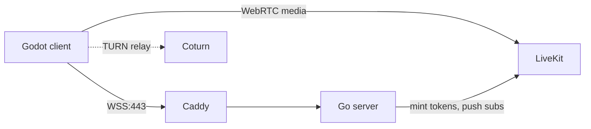

# Networking — Overview

Read this first, then drill into the sub-notes.

## The shift from pygame

The pygame original is a **peer-hosted LAN game**: one player's process binds UDP 5555, others discover via UDP broadcast on 5556, host enforces game rules. NAT, firewall, AP isolation, and "address already in use" are all real problems for users.

The Godot port becomes a **central authoritative server** model:

- Single Go process on the VPS owns all rooms and all match state.
- Clients are pure clients. Nobody hosts a listen-server.
- Single inbound port (TCP 443) for all gameplay traffic, fronted by Caddy TLS.
- No LAN broadcast, no discovery beacon, no host-as-subprocess.

Net result: less code, fewer support nightmares, works on every campus Wi-Fi.

## The four moving parts

1. **Auth + control plane** — JWT issued by Go, used in WS handshake. See [[Networking - Transport & Auth]].
2. **Rooms** — public/private with 6-char codes, server-side registry. See [[Networking - Room Model]].
3. **Gameplay sync** — Godot HLM (RPCs + `MultiplayerSynchronizer`) over `WebSocketMultiplayerPeer`. See [[Networking - Message Contract]].
4. **Voice/video** — LiveKit SFU, proximity-driven. See [[Networking - Proximity Media]].

## What pygame code disappears

| Pygame component | Replacement |
| --- | --- |
| `network/discovery.py` (UDP broadcast) | DELETED — server-owned room registry |
| `network/server.py` (host's subprocess) | DELETED — central Go server |
| `network/protocol.py` (hand-rolled UDP packets) | DELETED — RPCs + `MultiplayerSynchronizer` |
| `network/client.py` receiver thread | DELETED — Godot's main thread handles HLM |
| Heartbeat / RTT / loss tracking threads | Simplified — WS keepalive + Godot's `NetworkedMultiplayerPeer` stats |
| Reconnect tickets | Simplified — JWT in handshake, server re-attaches to existing session |
| Stale packet rejection | DELETED — WS is ordered/reliable |
| Avatar transfer protocol (chunked) | Simplified — single RPC with PNG bytes (≤8 KB typical) |
| Locks/queues around shared state | DELETED — Go server is single-writer per room goroutine |
| LAN AP-isolation troubleshooting | DELETED — no LAN code path exists |

## What we keep conceptually

| Concept | Stays because |
| --- | --- |
| Server-authoritative gameplay | Same in both; just moves from host's laptop to VPS |
| Host role (start match, kick, change settings) | UX expectation; just stored as `host_player_id` not a process |
| Match results aggregation | Same logic, different transport |
| Performance overlay (FPS, RTT, loss) | Still valuable, easier — Godot exposes most of it |
| Spectator / late-join replay of state | Server can resend canonical state on any join |

## What's actually new

- Hub world transport (continuous position sync for ~15 avatars at 10–20 Hz)
- Proximity media subscription control
- Persistent identity (an account, not a per-launch nickname)
- Public room browser

See [[Hub World - Design]] for the hub-specific bits.

## Related

- [[Networking - Transport & Auth]]
- [[Networking - Room Model]]
- [[Networking - Message Contract]]
- [[Networking - Proximity Media]]
- [[Skyward Race - Port Plan]]
