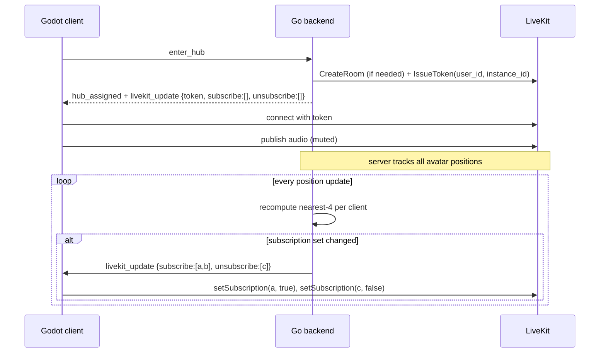

# Networking — Proximity Media

Voice and video in the hub world, scaled to the audience (~15 per instance, ~4 video subs per user).

## Model

| Stream | Policy | Why |
| --- | --- | --- |
| Audio | All instance peers subscribed; client adjusts volume by distance | Cheap (~14 × 32 kbps tracks ≈ 450 kbps inbound peak), feels natural |
| Video | Server picks ~4 nearest peers per client; opt-in publish | Bandwidth and CPU don't allow more on $6 box |

Default camera **off**. User toggles publish. Audio default **on** (mic muted by default though — opt-in unmute).

## Sequence



## Server-driven subscription

The Go backend tracks every avatar's position. Once a second (or on threshold crossing), it computes the 4 nearest other avatars per client and pushes diffs.

```go
// pseudo
const VideoNeighbors = 4

func (h *HubInstance) recomputeSubs() {
    for me := range h.players {
        nearest := h.kNearestUsers(me, VideoNeighbors)
        diff := h.players[me].videoSubs.Diff(nearest)
        if !diff.Empty() {
            h.send(me, LivekitUpdate{
                Subscribe:   diff.Added,
                Unsubscribe: diff.Removed,
            })
            h.players[me].videoSubs = nearest
        }
    }
}
```

Audio subscriptions are set once on join (everyone) and not touched.

## Distance volume curve

Client-side, no server involvement:

```
volume = clamp(1.0 - (distance_px / max_audible_px), 0.0, 1.0)
max_audible_px = 600
```

Linear is fine; ear physics not needed. Mute below 0.02 to save mixer work.

## Why LiveKit + not a mesh

For 15 peers a mesh is technically possible (105 unique connections per instance). It dies on:

- Upload bandwidth (each publisher pushes to 14 peers)
- Mobile CPU (each subscriber decodes 14 streams)
- Migration pain — moving off mesh once shipped is painful enough that the decision was made up-front to never ship one.

LiveKit SFU = each client publishes once to the server and subscribes to the N tracks it wants. CPU on the $6 box does the multiplexing.

## LiveKit on the $6 box

| Resource | Estimate |
| --- | --- |
| RAM | ~200 MB for 15 publishers + ~60 subscriptions |
| CPU | 30–60% of 1 vCPU steady state (no transcoding — selective forwarding only) |
| Bandwidth out | ~3 Mbps for one full instance (15 × 200 kbps avg) |

> [!warning] CPU budget is tight
> If we see sustained > 80% CPU on the box, the first lever is dropping video to 360p / 15 fps. After that, drop max neighbors to 3. Only after both would we look at splitting LiveKit to a second box.

## TURN

coturn runs on the same box as LiveKit. Most clients on residential ISPs in PH will NOT need TURN (STUN suffices), but some campus/corporate networks will. Budget ~5% of voice/video traffic going through TURN.

## What gets persisted

Nothing. No call recordings. No transcripts. LiveKit rooms are ephemeral — destroyed when the hub instance shuts down.

## Failure modes

| Failure | Behavior |
| --- | --- |
| LiveKit crashes | Client shows "voice unavailable", gameplay continues. Server restarts LiveKit. |
| Token expires mid-call (60 min) | Server pushes new `livekit_update` with refreshed token. Client reconnects to LiveKit silently. |
| Client's mic broken / permission denied | Client publishes silent track or no track. Receivers see them silent; no error UX needed. |
| User's video bandwidth saturated | LiveKit adapts (simulcast/SVC); receivers may see lower quality. |

## Related

- [[Hub World - Design]]
- [[Networking - Message Contract]]
- [[Architecture]]
- [[Infra & Hosting]]
