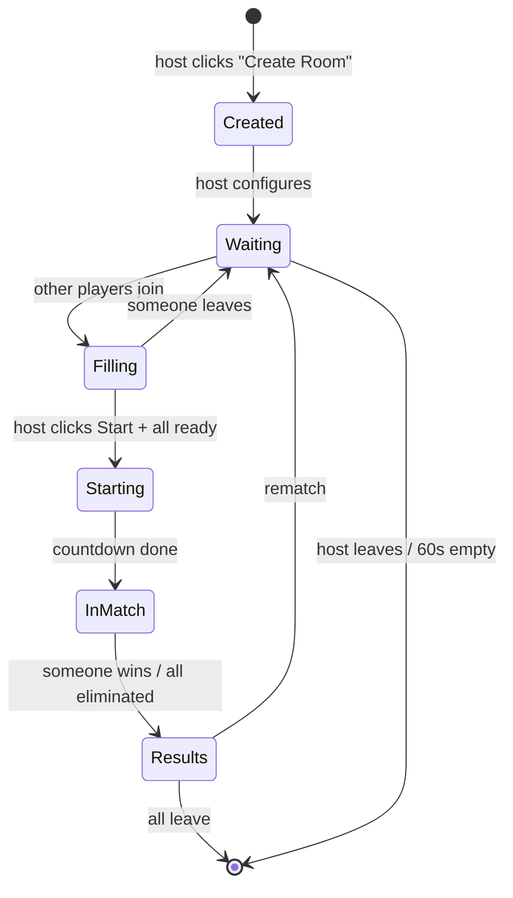

# Networking — Room Model

The room is the basic unit of multiplayer state. Every connected user is in exactly one room: the hub instance they spawned into, a Skyward Race lobby, or an in-progress match.

## Room types

| Type | Visibility | Capacity | Lifecycle |
| --- | --- | --- | --- |
| `hub_instance` | Auto-assigned | 15 | Server spawns on demand; idle 5 min → kill |
| `skyward_lobby` | public OR private | 8 | Created by user; idle 60 s empty → kill |
| `skyward_match` | inherited from lobby | 8 | Created when lobby starts; ends after results |

## Room code

```
6 characters, uppercase, charset = ABCDEFGHJKMNPQRSTUVWXYZ23456789
```

- 31 chars × 6 positions = ~887M combinations — collision risk irrelevant at this scale
- Skips visually ambiguous characters: `0 O 1 I L`
- Case-insensitive on join (always uppercased server-side before lookup)
- Reusable after the room closes — code namespace doesn't permanently burn
- Hub instances do **not** have codes (auto-assigned, not joinable by code)

## Public vs private

| Aspect | Public | Private |
| --- | --- | --- |
| Shows in room browser | Yes | No |
| Joinable by code | Yes (code shown to host) | Yes (code is the only way in) |
| Default when creating | No (private is default) | Yes |
| Friends discovery | Browser | Code shared via Discord/Messenger |

**Private-by-default rationale:** at this audience size, most matches are "me + my friends." A public toggle exists for pickup games but isn't the default.

## Lifecycle



## Room registry (server-side)

```go
type Room struct {
    ID           string         // ULID
    Code         string         // 6-char, unique while alive
    Type         RoomType       // hub_instance | skyward_lobby | skyward_match
    Visibility   Visibility     // public | private (n/a for hub)
    Name         string         // host-set, sanitized
    HostUserID   string         // SR rooms only
    Players      map[string]*Player
    State        RoomState      // waiting | starting | in_match | results
    LevelChoice  int            // SR-specific
    CreatedAt    time.Time
    LastActivity time.Time
    inbox        chan Message
    done         chan struct{}
}
```

Each room runs as its own goroutine consuming from `inbox`. Single-writer model — no locks on `Players` inside the goroutine. Other goroutines (HTTP handlers, other rooms) send via channel.

## Browser API

```
GET /rooms?type=skyward_lobby
→ 200 {
    "rooms": [
      {
        "code": "K7P3MX",
        "name": "Friday night chaos",
        "players": 3,
        "capacity": 8,
        "level": 4,
        "environment_id": "ice",
        "state": "waiting"
      },
      ...
    ]
  }
```

Plus push updates over the existing WS connection so the browser is live:

```
S→C  room_list_update { rooms: [...] }   // sent on change while client is on browser screen
C→S  subscribe_room_list                 // client tells server when browser is open
C→S  unsubscribe_room_list               // when client leaves browser
```

## Join flows

### Public room (browser)
```
C→S  join_room { code: "K7P3MX" }
S→C  join_ok { room_id, your_player_id, snapshot: {...} }
```

### Private room (code entry)
Same as above — the browser is just a shortcut for filling in `code`.

### Hub
```
C→S  enter_hub
S→C  hub_assigned { instance_id, snapshot: {...} }   // server picks instance with room
```

## Rate limits

| Action | Limit | Why |
| --- | --- | --- |
| Create room | 3 per minute per user | Prevent accidental spam |
| Join room | 10 per minute per user | Prevent code-brute-force |
| Room code lookup miss | 5 in a row → 30 s cooldown | Same |
| `subscribe_room_list` | 1 per second | Prevent thrash |

## Edge cases

- **Host disconnects mid-lobby** — server promotes next player by join order, broadcasts `host_changed`. UX: small toast.
- **Host disconnects mid-match** — match continues; results still get aggregated. Host role only matters in the lobby.
- **Code collision on create** — retry up to 5 times, then 500 (effectively never happens).
- **Player tries to join full room** — `join_err { reason: "full" }`.
- **Player tries to join in-match room** — depends on `allow_spectators` flag (default true for public, false for private). If allowed, they join as spectator; if not, `join_err { reason: "in_progress" }`.

## Related

- [[Networking - Message Contract]]
- [[Networking - Transport & Auth]]
- [[Networking - Overview]]
