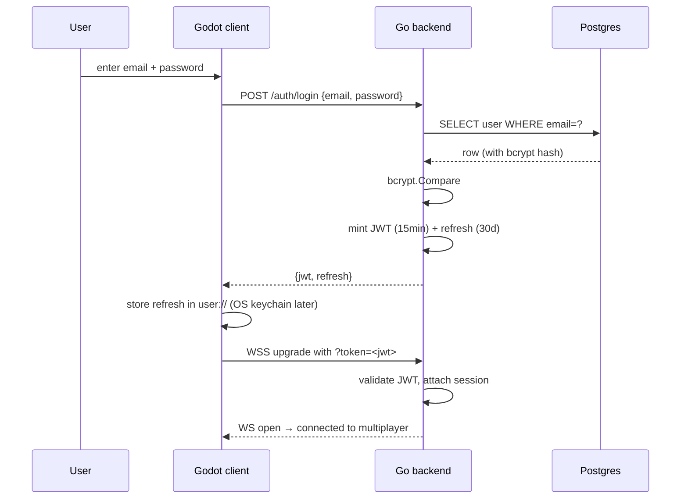
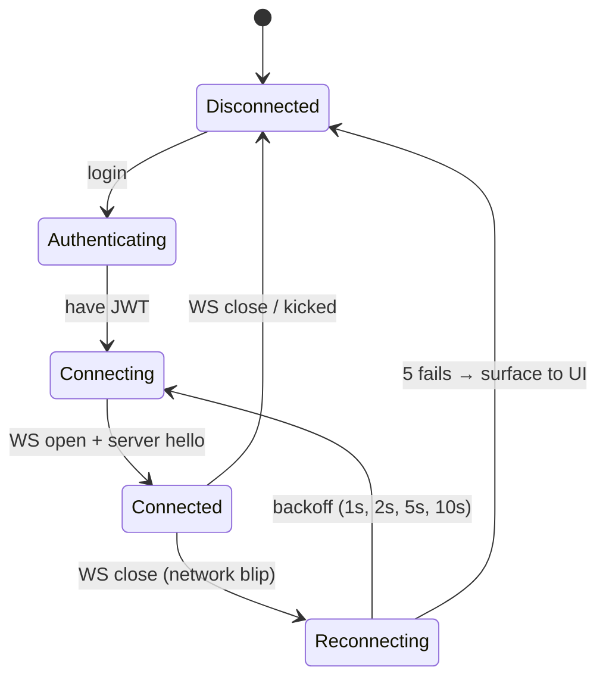

# Networking — Transport & Auth

## Why WebSocketMultiplayerPeer

| Option | Pros | Cons | Verdict |
| --- | --- | --- | --- |
| `ENetMultiplayerPeer` (UDP) | Lowest latency, unreliable channels | Blocked on many campus/cafe Wi-Fi (AP isolation, UDP filtering); needs extra port through firewall; no TLS | Skip |
| `WebSocketMultiplayerPeer` (WSS) | Works through every NAT/firewall that allows HTTPS; same port 443 as the API; TLS for free via Caddy | TCP head-of-line blocking; ~15 ms overhead at PH↔SG | **Choose** |
| `WebRTCMultiplayerPeer` | True P2P, no relay cost | Signaling complexity; not needed when server is authoritative | Skip |
| GodotSteam Multiplayer Peer | Steam relay, friends graph | $100 Steam Direct deposit; no Steam dev account yet | Defer |
| Raw UDP (custom) | Total control | Reimplements ordering, reliability, reconnect | Hard no |

WSS wins because the VPS is on a public IP — TCP head-of-line is fine at this RTT and audience scale, and the operational savings (one port, one cert, one firewall rule) are huge.

## Swappable peer abstraction

Wrap the `MultiplayerPeer` in an AutoLoad so the gameplay code never knows which transport is in use.

```gdscript
# autoloads/network_backend.gd
extends Node

enum Backend { WEBSOCKET, ENET_LOCAL, STEAM }

var peer: MultiplayerPeer
var backend: Backend = Backend.WEBSOCKET

func connect_to_server(jwt: String) -> Error:
    match backend:
        Backend.WEBSOCKET:
            var ws := WebSocketMultiplayerPeer.new()
            var url := "wss://hub.example.com/ws?token=%s" % jwt.uri_encode()
            var err := ws.create_client(url)
            if err == OK:
                peer = ws
                multiplayer.multiplayer_peer = peer
            return err
        Backend.ENET_LOCAL:
            # for offline dev / class demo
            ...
        Backend.STEAM:
            # placeholder — implement when/if we ship on Steam
            ...
    return ERR_UNAVAILABLE
```

This is the single seam between gameplay code and transport. Everything else uses `@rpc`, `MultiplayerSynchronizer`, `MultiplayerSpawner` — vanilla Godot HLM.

## Auth flow



## JWT contents

```json
{
  "sub": "user_01HXYZ...",
  "name": "kurt",
  "iat": 1716480000,
  "exp": 1716480900,
  "iss": "hub.example.com"
}
```

- HS256 with a server-side secret (rotated yearly).
- `sub` is the only identifier the server uses internally — `name` is for display.
- 15 min access token, 30 day refresh token (refresh stored client-side, server tracks revocations in a small `refresh_tokens` table).

## WS handshake

Token goes in the query string (Godot's WS client doesn't currently expose custom headers cleanly):

```
GET /ws?token=eyJhbGc...  HTTP/1.1
Upgrade: websocket
```

> [!warning] Token-in-URL caveat
> Tokens in query strings can leak to access logs. Mitigations: log only `?token=REDACTED`, keep access token TTL short (15 min), use refresh for re-issuance.

## Connection lifecycle



Server-side, a brief disconnect (< 30 s) keeps the user's session and room membership warm — reconnect re-attaches without rejoining. Longer than 30 s and the room may have moved on; client returns to hub.

## Performance budget

- Tick rate: 20 Hz for hub position sync, 30 Hz for Skyward Race
- Per-client outbound: ≤ 10 KB/s steady state
- RTT target: < 80 ms PH↔SG (typical 40–60 ms observed on residential fiber)
- WS keepalive ping: 30 s interval

## Related

- [[Networking - Overview]]
- [[Networking - Message Contract]]
- [[Networking - Room Model]]
- [[Architecture]]
