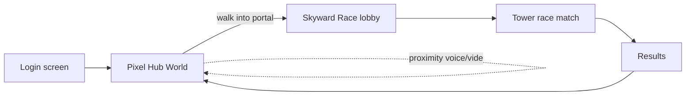

# Vision

## The product

A small pixel-art social world. Users walk an avatar around a hub, talk to nearby friends with proximity voice, and step into portals that drop them into minigames. The first minigame is **Skyward Race** (the tower racer originally built for CS323).

Not a metaverse. Not a startup pitch. A place for ~50 school friends to hang out and play.

## Audience

| Trait | Value |
| --- | --- |
| Total user pool | ~50 |
| Concurrent peak per hub instance | ~15 |
| Per-user proximity video subscriptions | ~4 |
| Geography | Philippines (Asia hosting required) |
| Connection profile | Mixed home Wi-Fi + campus Wi-Fi (some block UDP) |

All scope decisions follow from this. Anything designed for >50 users is over-engineering.

## Two products, one binary

The Godot client ships both worlds. From the user's perspective they log in once, see the hub, walk around, talk to friends, and step into a portal when they want to race. No separate "lobby app" / "game app" split.

## Non-goals

- Cross-platform mobile. Windows desktop first; Linux/Mac if free.
- Persistent character progression / RPG layer.
- User-generated content / Workshop.
- Public matchmaking beyond a simple [[Networking - Room Model|public room browser]].
- Anti-cheat hardening — server-authoritative is enough; no kernel drivers.
- Hitting >50 concurrent. If it grows, replan then.

## Why this combination is worth building

The two halves cover both class-project requirements and a real product the user actually wants to use with friends:

- **Skyward Race** satisfies CS323's PDC criteria (real-time sync, concurrent state, message passing, performance measurement) and is the existing graded artifact.
- **The hub** is the social layer that makes people open the app when they're not racing. Proximity voice/video is the differentiator vs Discord — you bump into people instead of joining a channel.

## Related

- [[Architecture]]
- [[Roadmap]]
- [[Skyward Race - Port Plan]]
- [[Hub World - Design]]
